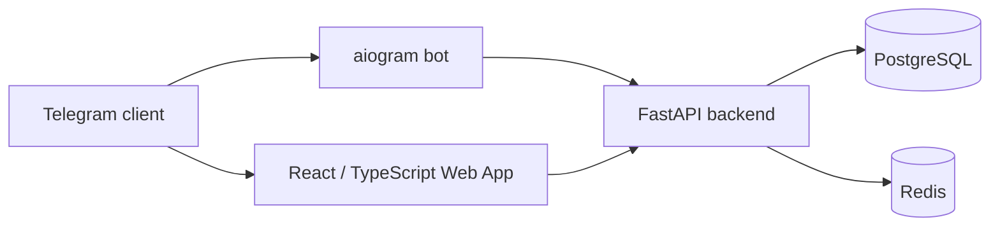

# Telegram Wish List Bot & Web App

A full-stack Telegram product for creating, organizing, sharing, and reserving wish-list items through a bot and an embedded Telegram Web App.


> Portfolio project demonstrating Telegram product development, FastAPI backend architecture, PostgreSQL persistence, Redis integration, Dockerized local environments, and a React/TypeScript Web App.

## Product capabilities

### Telegram bot

- `/start`, `/add`, `/list`, and `/share` flows
- quick wish creation from messages
- inline buttons for opening the Web App
- birthday reminder workflows

### Telegram Web App

- wish cards with images and priorities
- drag-and-drop ordering
- search, filters, and categories
- group wish lists
- gift reservation without exposing the reservation to the recipient
- statistics and basic analytics
- link parsing for marketplace items

### Group workflows

- friend and family groups
- birthday calendar
- gift discussion and coordination
- shared lists for gift selection

## Architecture



## Backend stack

- FastAPI and Uvicorn
- aiogram 3
- SQLAlchemy 2 and Alembic
- PostgreSQL with asyncpg
- Redis
- Pydantic 2
- JWT-compatible security utilities

## Frontend stack

- React 18
- TypeScript
- Vite
- Telegram Web App SDK
- React Query
- React Hook Form
- drag-and-drop UI
- Tailwind CSS

## Local environment

Docker Compose starts:

- PostgreSQL with a health check;
- Redis with a health check;
- FastAPI backend;
- Telegram bot worker;
- React frontend.

The backend and bot wait for healthy database and Redis services before startup.

## Quick start

### Requirements

- Docker and Docker Compose
- Telegram bot token from BotFather

### Run

```bash
git clone https://github.com/downmeansoff/telegram-wishlist-bot.git
cd telegram-wishlist-bot
cp .env.example .env
```

Configure at least:

```env
TELEGRAM_BOT_TOKEN=your_bot_token
SECRET_KEY=generate_a_strong_secret
POSTGRES_PASSWORD=choose_a_password
```

Start the stack:

```bash
docker compose up -d --build
```

Apply database migrations:

```bash
docker compose exec backend alembic upgrade head
```

Services:

- Web App: `http://localhost:3000`
- API: `http://localhost:8000`
- Swagger UI: `http://localhost:8000/docs`
- ReDoc: `http://localhost:8000/redoc`

## Repository structure

```text
telegram-wishlist-bot/
├── backend/
│   ├── app/
│   │   ├── api/
│   │   ├── bot/
│   │   ├── core/
│   │   ├── models/
│   │   ├── schemas/
│   │   ├── services/
│   │   └── main.py
│   ├── alembic/
│   ├── requirements.txt
│   └── Dockerfile
├── frontend/
│   ├── src/
│   ├── package.json
│   └── Dockerfile.dev
├── docker-compose.yml
└── .env.example
```

## Database domains

- users
- wishes
- categories
- groups and group members
- reservations
- notifications

## Production deployment model

The backend can be deployed to a container platform such as Railway or Render with managed PostgreSQL and environment-based configuration. The frontend can be deployed separately to Vercel or Netlify.

Recommended production requirements:

- HTTPS-only Web App URL;
- Telegram init-data validation;
- secrets stored outside the repository;
- database backups;
- webhook-based bot delivery;
- structured logs and monitoring;
- migrations executed as a controlled release step.

## Backup example

```bash
docker compose exec postgres pg_dump -U wishlist_user wishlist_db > backup.sql
```

Restore:

```bash
docker compose exec -T postgres psql -U wishlist_user wishlist_db < backup.sql
```

## Security considerations

- Telegram Web App init-data validation
- environment-based secrets
- CORS configuration
- input validation through Pydantic
- ORM-based database access
- React output escaping
- rate-limiting support

## Roadmap

- payment integrations
- AI-assisted gift recommendations
- calendar integrations
- PDF export
- dark theme
- multilingual interface

## License

MIT License
